# Project Flow Diagram: Wi-Fi CSI Fall Detection System

This document provides a highly detailed flow diagram of the entire system, from hardware signal generation to real-time activity classification and alert dispatch.

## 📊 System Architecture & Data Flow

```mermaid
graph TD
    subgraph "1. Hardware Layer (Data Acquisition)"
        TX["TX Node (ESP32): Generates HT40 UDP Packets @ 100Hz"]
        Air["Wireless Channel: Multipath Interference via Human Motion"]
        RX["RX Node (ESP32): Captures Raw CSI via WiFi Callback"]
        Analog["Analog Signal -> Digital I/Q Samples (256B packets)"]
        
        TX --> Air --> RX --> Analog
    end

    subgraph "2. Data Intake & Parsing (fall_detector_logic/src/data/parser.py)"
        Host["Host PC: AsyncSerialReader (921600 baud)"]
        Queue["Threaded Work Queue: Prevents Buffer Overflows"]
        Parsing["CSIParser: Extract I and Q components"]
        Amplitude["Calculate Amplitude: sqrt(I² + Q²)"]
        SubcarrierMapping["Subcarrier Mapping: Map to 114 Valid Carriers (HT40)"]
        Filtering["RSSI Filtering: Drop packets below -85dBm threshold"]

        Analog --> Host --> Queue --> Parsing --> Amplitude --> SubcarrierMapping --> Filtering
    end

    subgraph "3. Preprocessing Pipeline (fall_detector_logic/src/data/preprocessor.py)"
        Median["Median Filter (k=3): Remove salt-and-pepper noise"]
        Impulse["Impulse Removal: Smooth sudden signal spikes"]
        Standardization["Z-Score Normalization: (X - mean) / std"]
        Windowing["Sliding Window: 50 samples (500ms) with 50% overlap"]

        Filtering --> Median --> Impulse --> Standardization --> Windowing
    end

    subgraph "4. Training Workflow (fall_detector_logic/scripts/train_model.py)"
        Augmentation["Data Augmentation: Gaussian Noise, Scaling, Time-Shifting"]
        KFold["Stratified K-Fold: 5-way cross-validation"]
        CNN["CNN Layers: Extract spatial features from subcarriers"]
        GRU["GRU Layers: Capture temporal dynamics/motion patterns"]
        Export["Weight Export: Saved to fall_detector_logic/models/"]

        Windowing --> Augmentation --> KFold --> CNN --> GRU --> Export
    end

    subgraph "5. Real-time Inference (fall_detector_logic/runners/)"
        Load["Load Model & Pre-fitted Global Scaler"]
        Buffer["CSIRingBuffer: Continuous stream of 50-sample windows"]
        Predict["CNN-GRU Inference: Softmax class probabilities"]
        EMA["EMA Smoothing (α=0.4): Debounce prediction jitter"]
        Logic{"Fall Alert Logic: >65% Prob for 3 consecutive windows?"}
        Action["Trigger Alert: POST to alert_python_backend"]

        Export -. "One-time Load" .-> Load
        Windowing --> Buffer --> Predict --> EMA --> Logic
        Logic -- "Condition Met" --> Action
    end

    subgraph "6. Alert Backend (alert_python_backend/)"
        Backend["alert_sender.py: Receives fall detection event"]
        FCM["Send Firebase Cloud Messaging (FCM) notification"]
        App["Mobile app receives push notification"]
        
        Action --> Backend --> FCM --> App
    end

    %% Configuration Note
    Note1["<b>System Config (fall_detector_logic/config/settings.py)</b><br/>Packet Rate: 100Hz<br/>Subcarriers: 114<br/>Window: 500ms<br/>Overlap: 50%<br/>Model: CNN-GRU Hybrid"]
```

## 🔍 Detailed Component Breakdown

### 1. Variables Accessed (Per module)
| Module | Core Variables Accessed | Purpose |
| :--- | :--- | :--- |
| **Parser** | `settings.RSSI_FLOOR` | Noise exclusion threshold |
| | `settings.SUBCARRIERS` | Target output dimension (114) |
| **Preprocessor** | `settings.DENOISE_KERNEL` | Size of median filter window |
| | `settings.NORMALIZE` | Toggle for Z-score scaling |
| **Trainer** | `settings.CNN_FILTERS` | Complexity of spatial extraction |
| | `settings.LEARNING_RATE` | Adam optimizer tuning |
| **Inference** | `settings.FALL_PROBABILITY_THRESHOLD` | Sensitivity of fall alert |
| | `settings.CONSECUTIVE_DETECTIONS` | Debouncing for false positives |
| **Alert Backend** | Firebase Service Account | FCM notification dispatch |

### 2. Logic Steps
1.  **Intake**: Serial data is ingested via an asynchronous queue to prevent packet loss.
2.  **Harmonization**: Regardless of if the incoming data is 52 (HT20) or 192 (firmware) subcarriers, the `CSIParser` interpolates or slices it to a fixed **114 subcarriers**.
3.  **Temporal Windowing**: The ML model never looks at a single packet; it looks at a **window of 50 packets** (a 500ms time slice).
4.  **Duality**: In **Training**, the scaler is `fit`. In **Inference**, the scaler is `loaded` to ensure the real-time data matches the statistical distribution the model was trained on.
5.  **Fall Detection**: A "Fall" is only alerted if the probability persists for **3 consecutive windows** to avoid momentary signal spikes triggering false alarms.
6.  **Alert Dispatch**: On successful fall detection, the inference system sends an alert to the Python backend, which dispatches Firebase notifications to registered mobile devices.
