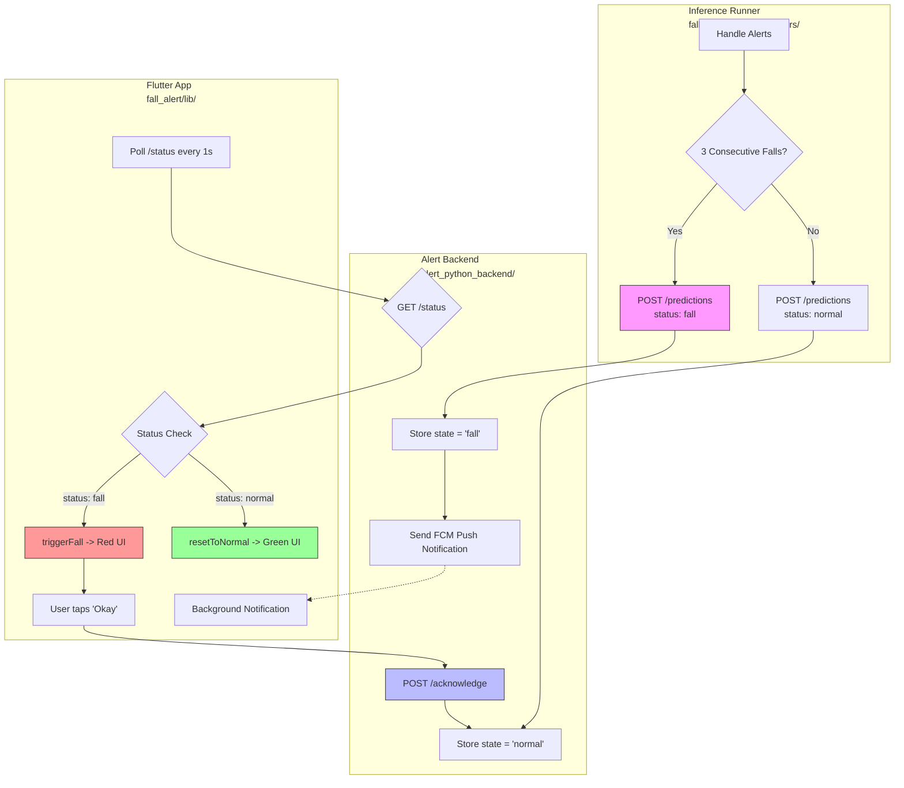

Inference Runner                     Alert Backend                        Flutter App
─────────────────                    ─────────────                        ───────────
fall_detector_logic/                 alert_python_backend/                fall_alert/
runners/                             alert_sender.py                      lib/pages/
_handle_alerts()                        │                                  home_page.dart
  │                                    │                                  │
  ├─ fall detected (3 consecutive)     │                                  │
  │   → POST /predictions              │                                  │
  │     {"status": "fall"}  ──────────►│ stores state = "fall"            │
  │                                    │ sends FCM push notification ────►│ background notification
  │                                    │                                  │
  │                                    │ GET /status ◄────────────────────│ polls every 1s
  │                                    │   → {"status": "fall"} ─────────►│ triggerFall() → red UI
  │                                    │                                  │
  │                                    │ POST /acknowledge ◄──────────────│ user taps "Okay"
  │                                    │   → state = "normal"             │
  │                                    │   → fall_locked = false          │
  ├─ no fall                           │                                  │
  │   → POST /predictions             │                                  │
  │     {"status": "normal"} ────────►│ stores state = "normal"          │
  │                                    │ GET /status ◄────────────────────│ polls every 1s
  │                                    │   → {"status": "normal"} ───────►│ resetToNormal() → green UI

## FLOWCHART

